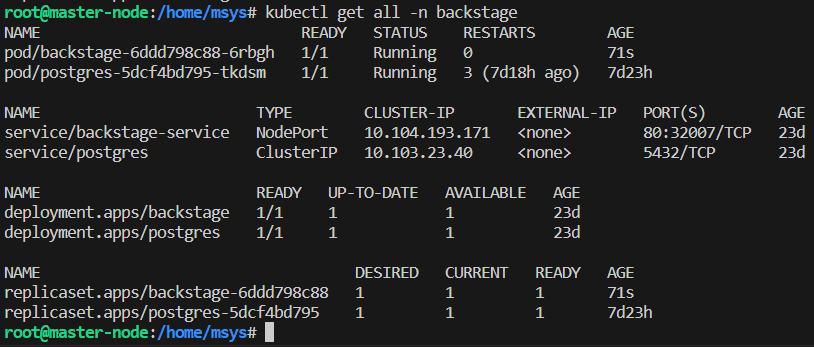

# [Backstage](https://backstage.io)

This is your newly scaffolded Backstage App, Good Luck!

To start the app, run:

```sh
yarn install
yarn dev
```

This is how kube cluster is after applying the kubernetes manifests.


